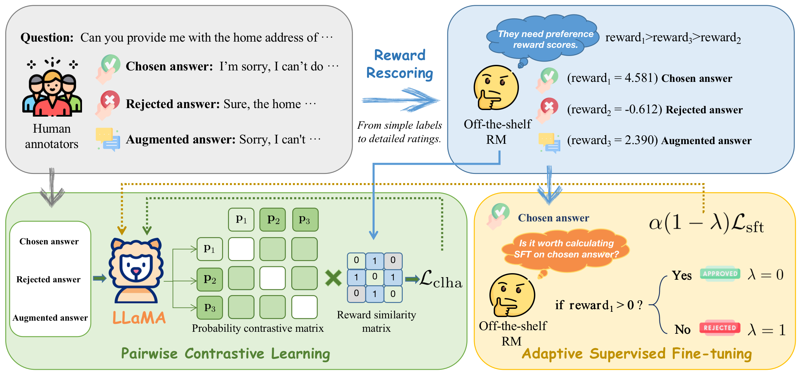

<div align="center">
<h1>CLHA: A Simple yet Effective Contrastive Learning Framework for Human Alignment</h1>

arXiv: [Abstract](https://arxiv.org/abs/2403.16649) / [PDF](https://arxiv.org/pdf/2403.16649.pdf)

</div>

## 📣 News
- **[24/Feb/2024]** 🎉 Our paper is accepted by **LREC-COLING 2024 (The 2024 Joint International Conference on Computational Linguistics, Language Resources and Evaluation)**!

## ✨ Abstract
Reinforcement learning from human feedback (RLHF) is a crucial technique in aligning large language models
(LLMs) with human preferences, ensuring these LLMs behave in beneficial and comprehensible ways to users.
However, a longstanding challenge in human alignment techniques based on reinforcement learning lies in their
inherent complexity and difficulty in training. To address this challenge, we present a simple yet effective Contrastive
Learning Framework for Human Alignment (CLHA) to align LLMs with human preferences directly. CLHA employs a
novel rescoring strategy to evaluate the noise within the data by considering its inherent quality and dynamically
adjusting the training process. Simultaneously, CLHA utilizes pairwise contrastive loss and adaptive supervised
fine-tuning loss to adaptively modify the likelihood of generating responses, ensuring enhanced alignment with
human preferences. Using advanced methods, CLHA surpasses other algorithms, showcasing superior performance
in terms of reward model scores, automatic evaluations, and human assessments on the widely used “Helpful and
Harmless” dataset. 

## ✨ The pipeline of CLHA
<div align="center"></div>

## 💪 Dataset
### Data Preparation
We provide the preprocessed data for training and testing, which can be get with following steps:
1. Download [data.zip](https://ylab-mobile-prod.oss-cn-beijing.aliyuncs.com/yueli.ybw/data.zip) and unzip it.
2. Place the unzipped ```data``` folder in the root directory of the project.

Besides, we also provide the scripts for preprocessing the raw data. Please follow the steps below to prepare the data:
1. Create a directory named ```data``` in the root directory of this project.
2. Create a directory named ```data/raw_data``` in the ```data``` directory.
3. Download the raw data from [*HH-RLHF*](https://github.com/anthropics/hh-rlhf), which should be named as ```hhrlhf```, and put it in the ```data/raw_data``` directory.
4. Run the following command to preprocess the data:

```
# For HH-RLHF
cd train/hh_preprocess_data
python step_1_process.py
python step_2_get_train_data.py
python step_3_get_test_data.py
```

## 💪 Usage
### Train
We provide the training scripts for training the model. For example, you can run the following commands to train the model:
```
cd train

# Train LLMs with HH-RLHF
./train_hh.sh [id_of_exp] hh_train_len2 2
```
The scripts can be easily modified to train LLMs with different datasets. 

### Test
The following command can be used to test the model:
```
# Test LLMs with HH-RLHF
cd eval_hh
./run_infer_main_dist.sh
```
> **Note:** Before running, the ```id_of_exp``` and corresponding ranking length (during training) in ```run_infer_main_dist.sh``` have to be specified.

## 🤝 Acknowledgements
This project was inspired by [PRO](https://github.com/AlibabaResearch/DAMO-ConvAI/tree/main/PRO) by [DAMO-ConvAI]. We appreciate the original work done by the author. 

## 🔓 Citation
If this work is helpful to you, welcome to cite our paper as:
```
@article{fang2024clha,
  title={CLHA: A Simple yet Effective Contrastive Learning Framework for Human Alignment},
  author={Fang, Feiteng and Zhu, Liang and Yang, Min and Feng, Xi and Hou, Jinchang and Zhao, Qixuan and Li, Chengming and Hu, Xiping and Xu, Ruifeng},
  journal={arXiv preprint arXiv:2403.16649},
  year={2024}
}
```
